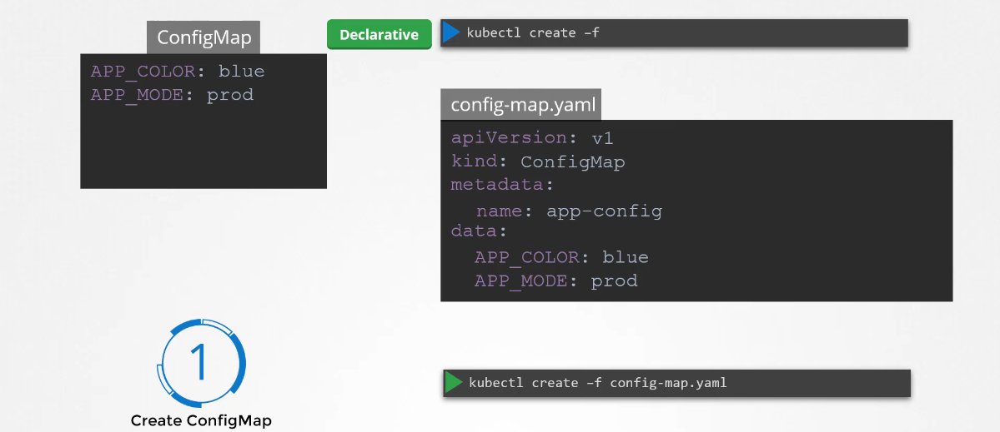

# Application Lifecycle Management

## Deployment Stratagies

- Recreate : Kill old pods, then start new pods. It has downtime.
- Rollout : It is the default strategy. It gradually replace old pods with new ones.  It has Zero downtime.

## Rolling Updates and Rolebacks

To apply changes in deployments

`kubectl apply -f deployment-def.yaml`

To make change in image version

`kubectl set image deployment/my-app-deployment <container>=<new-image>`

To check rollout status

`kubectl rollout status deployment/my-app-deployment`

`kubectl rollout history deployment/my-app-deployment`

To rollback new change

`kubectl rollout undo deployment/my-app-deployment`

## Commands and Arguments

## ENV in K8s

## Configmap in K8s

### Create configmap

Imperative

Declarative

### Inject configmaps to Pods

## Secrets in K8s

### Create Secretes

Imperative

Declerative

### Encode secrets

### Inject secrets to Pods

## Multi Container Pods

## Init Containers

## Self healing

## HPA

## VPA

## In place resize of Pods

