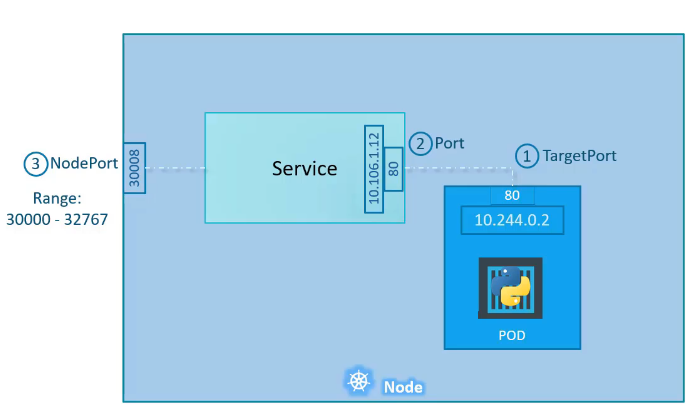

# K8s Components

### 1.Services
It allows communication between components of your app, even when Pods get recreated or rescheduled.
#### Why do we need services?
Pods in Kubernetes are ephemeral:
- Each Pod gets a dynamic IP address.
- If a Pod dies or restarts, its IP changes.
- This makes direct communication with Pods unreliable.

#### Solution: Kubernetes Service
- Provides a stable IP and DNS name.
- Automatically routes traffic to matching Pods using label selectors.
- service are of 3 types
  - Nodeport
  - ClusterIP
  - Loadbalancer
 
#### Nodeport Service

 
   
