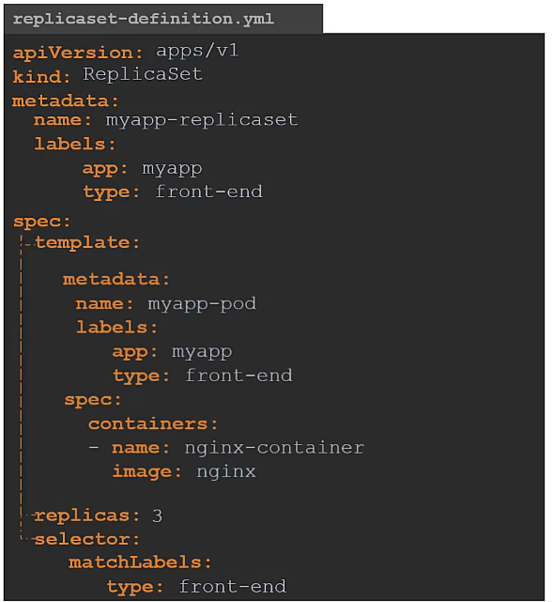
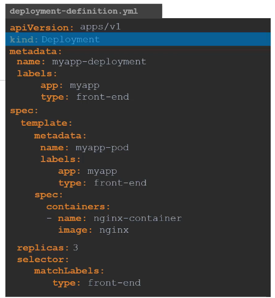
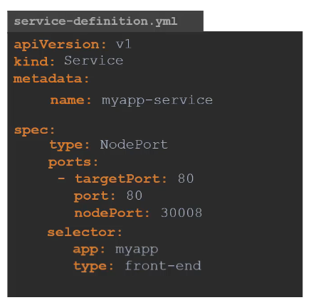

# K8s Resources

### 1.Pods

### 2.Replication Controller

### 3.Replica-Set

### 3.Deployment

### 4.Service
#### Nodeport

#### ClusterIP

#### Loadbalancer

### 5.Namespace

### 3.Resource Quota

