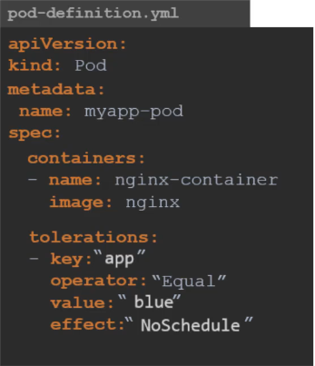
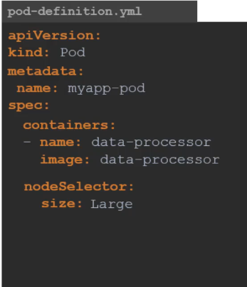

## Scheduling commands

### Taint and Tolerations

Taints and tolerations are only meant to restrict nodes from accepting certain pods.Taints and tolerations does not tell a pod to go to particular node, instead it tell node to only accept pods with certain tolerations.  

#### Taint- Node

Syntax

`kubectl taint nodes node-name key=value:taint-effect`

Taint effect can be `NoSchedule/PreferNoSchedule/NoExecute`

Example

`kubectl taint nodes node1 app=blue:NoSchedule`

#### Tolerations- PODs

### Node Selector

One of the simplest method to limit a pod to run on particular node using node labels.

For that first we need to label the nodes

`kubectl label nodes <node-name> <key>=<value>`

`kubectl label nodes node1 size=large`

Then we need to update the pods with nodeselector tag.

One limitation of node selector is that it cannot be used on complex requirements i.e 
- what if we want to select either large or medium nodes?
- NOT small

