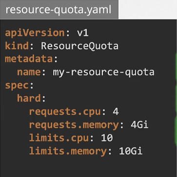

## Scheduling commands

### Taint and Tolerations

Taints and tolerations are only meant to restrict nodes from accepting certain pods.Taints and tolerations does not tell a pod to go to particular node, instead it tell node to only accept pods with certain tolerations.  

#### Taint- Node

Syntax

`kubectl taint nodes node-name key=value:taint-effect`

Taint effect can be `NoSchedule/PreferNoSchedule/NoExecute`

Example

`kubectl taint nodes node1 app=blue:NoSchedule`

#### Tolerations- PODs

### Node Selector

One of the simplest method to limit a pod to run on particular node based node labels.

For that first we need to label the nodes

`kubectl label nodes <node-name> <key>=<value>`

`kubectl label nodes node1 size=large`

Then we need to update the pods with nodeselector tag.

One limitation of node selector is that it cannot be used on complex requirements i.e 
- what if we want to select either large or medium nodes?
- NOT small

### Node Affinity

The node affinity provide advance capabalities to limit pod placement on a specific nodes. 

#### Node Affinity Types

- requiredDuringSchedulingIgnoreDuringExecution
- preferredDuringSchedulingIgnoreDuringExecution
- requiredDuringSchedulingRequiredDuringExecution

### Request and Limits

- Resource requests are the guraranteed amount of memory and cpu available for the pod.
- Resource limits are maximum amount of resource a pod is allowed to use.

By default any pod can consume as much as resource required on any node but this will suffocate other pods and processes running on the node.

### ResourceQuota

A ResourceQuota is a namespace-level constraint that limits the total amount of compute or storage resources that can be consumed by all the pods, containers, or other resources within that namespace.

